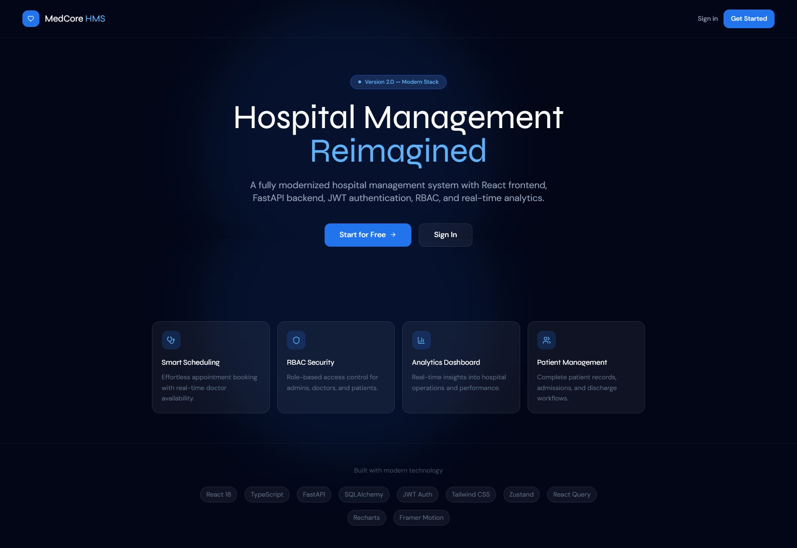
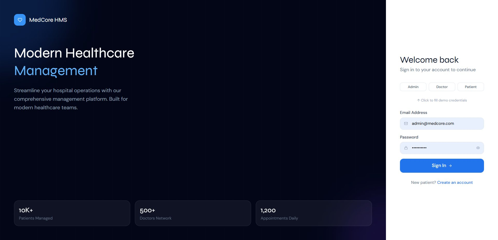
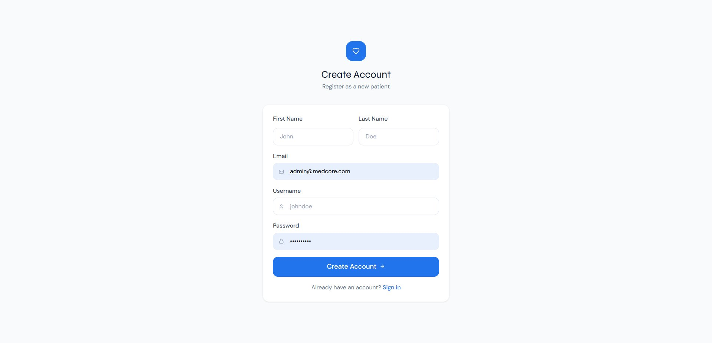

# 🏥 MedCore HMS v2.0

### Modern Hospital Management System

## 📸 Preview

### Landing Page



### Login Page



### Register Page



---

A fully upgraded, production-ready hospital management system built with a modern tech stack — replacing the legacy Django/template system with a clean React + FastAPI architecture.

---

## ✨ What's New in v2.0

| Feature    | Old (Django)     | New (MedCore v2)                 |
| ---------- | ---------------- | -------------------------------- |
| Frontend   | Django Templates | **React 18 + TypeScript**        |
| Backend    | Django Views     | **FastAPI (async)**              |
| API        | Server-rendered  | **REST API + OpenAPI docs**      |
| Auth       | Django sessions  | **JWT + Refresh tokens**         |
| Security   | Group-based      | **RBAC (Role-based)**            |
| Database   | ORM (sync)       | **SQLAlchemy async**             |
| UI         | Bootstrap 3      | **Tailwind CSS + Framer Motion** |
| State      | Page reloads     | **Zustand + React Query**        |
| Deployment | Manual           | **Docker Compose**               |

---

## 🏗️ Architecture

```
medcore-hms/
├── frontend/              # React 18 + TypeScript + Vite
│   ├── src/
│   │   ├── components/    # Reusable UI components
│   │   │   └── layout/    # DashboardLayout with collapsible sidebar
│   │   ├── pages/
│   │   │   ├── admin/     # Admin dashboard, doctors, patients, appointments
│   │   │   ├── doctor/    # Doctor dashboard, schedule, patients
│   │   │   └── patient/   # Patient dashboard, appointments, doctors
│   │   ├── services/      # Axios API client with auto-refresh
│   │   ├── store/         # Zustand auth store (persisted)
│   │   └── styles/        # Tailwind global styles
│   └── Dockerfile
│
├── backend/               # FastAPI + SQLAlchemy Async
│   ├── app/
│   │   ├── api/v1/        # Versioned REST endpoints
│   │   │   └── endpoints/ # auth, doctors, patients, appointments, dashboard
│   │   ├── core/          # Config, DB, Security utilities
│   │   ├── models/        # SQLAlchemy ORM models
│   │   ├── schemas/       # Pydantic request/response schemas
│   │   └── services/      # Business logic layer
│   ├── main.py
│   ├── requirements.txt
│   └── Dockerfile
│
├── docker-compose.yml     # Full stack deployment
└── README.md
```

---

## 🚀 Quick Start

### Option 1: Docker (Recommended)

```bash
# Clone and start everything
git clone <repo>
cd medcore-hms

# Copy environment files
cp backend/.env.example backend/.env
cp frontend/.env.example frontend/.env

# Start all services
docker-compose up -d

# Access:
# Frontend: http://localhost:80
# API Docs: http://localhost:8000/api/docs
```

### Option 2: Local Development

**Backend:**

```bash
cd backend
python -m venv venv
source venv/bin/activate  # Windows: venv\Scripts\activate
pip install -r requirements.txt

cp .env.example .env
# Edit .env with your settings

uvicorn main:app --reload --port 8000
# API available at: http://localhost:8000
# Swagger docs at: http://localhost:8000/api/docs
```

**Frontend:**

```bash
cd frontend
npm install

cp .env.example .env
# VITE_API_URL=http://localhost:8000/api/v1

npm run dev
# App available at: http://localhost:3000
```

---

## 🔐 Demo Credentials

| Role    | Email               | Password     |
| ------- | ------------------- | ------------ |
| Admin   | admin@medcore.com   | Admin@1234   |
| Doctor  | doctor@medcore.com  | Doctor@1234  |
| Patient | patient@medcore.com | Patient@1234 |

---

## 🎭 User Roles & Permissions

### 👑 Admin

- View all dashboard analytics & charts
- Manage doctors (add, approve, remove)
- Manage patients (admit, discharge)
- View/approve all appointments
- Generate discharge bills & invoices

### 🩺 Doctor

- Personal dashboard with schedule
- View assigned patients
- Manage own appointments (approve/complete)
- View patient discharge details

### 🧑‍⚕️ Patient

- Personal health dashboard
- Book appointments with doctors
- View appointment history
- Access discharge bills

---

## 📡 API Endpoints

| Method | Endpoint                       | Description           |
| ------ | ------------------------------ | --------------------- |
| POST   | `/api/v1/auth/login`           | Authenticate user     |
| POST   | `/api/v1/auth/register`        | Register patient      |
| POST   | `/api/v1/auth/refresh`         | Refresh JWT token     |
| GET    | `/api/v1/doctors/`             | List doctors          |
| POST   | `/api/v1/doctors/`             | Create doctor (admin) |
| PATCH  | `/api/v1/doctors/{id}/approve` | Approve doctor        |
| GET    | `/api/v1/patients/`            | List patients         |
| PATCH  | `/api/v1/patients/{id}/admit`  | Admit patient         |
| GET    | `/api/v1/appointments/`        | List appointments     |
| POST   | `/api/v1/appointments/`        | Book appointment      |
| GET    | `/api/v1/dashboard/stats`      | Admin analytics       |

Full API documentation available at `/api/docs` (Swagger) or `/api/redoc`.

---

## 🛠️ Tech Stack

### Frontend

- **React 18** - UI framework with concurrent features
- **TypeScript** - Type safety
- **Vite** - Fast build tool
- **Tailwind CSS** - Utility-first styling
- **Framer Motion** - Smooth animations
- **React Router v6** - Client-side routing
- **Zustand** - Lightweight state management (persisted)
- **TanStack Query** - Server state & caching
- **Axios** - HTTP client with interceptors
- **Recharts** - Dashboard analytics charts
- **React Hot Toast** - Toast notifications

### Backend

- **FastAPI** - Modern async Python web framework
- **SQLAlchemy 2.0** - Async ORM
- **Pydantic v2** - Data validation
- **Python-JOSE** - JWT authentication
- **Passlib/bcrypt** - Password hashing
- **Uvicorn** - ASGI server

### Infrastructure

- **Docker + Docker Compose** - Containerization
- **PostgreSQL** - Production database
- **Redis** - Caching layer
- **Nginx** - Reverse proxy & static files

---

## 🔒 Security Features

- **JWT Authentication** with access + refresh token rotation
- **RBAC** (Role-Based Access Control) - Admin, Doctor, Patient
- **Password hashing** with bcrypt
- **CORS** protection with configurable origins
- **Input validation** with Pydantic schemas
- **SQL injection protection** via ORM
- **Rate limiting** ready (configurable)

---

## 📦 Production Deployment

```bash
# Set production environment variables
export SECRET_KEY="your-very-secure-secret-key-min-32-chars"
export DB_PASSWORD="your-secure-database-password"

# Build and deploy
docker-compose -f docker-compose.yml up -d --build

# Scale backend workers
docker-compose up -d --scale backend=3
```

---

## 🔮 Future Expansion

- [ ] Real-time notifications (WebSocket)
- [ ] SMS/Email appointment reminders
- [ ] Telemedicine video calls
- [ ] Lab results & medical records
- [ ] Prescription management
- [ ] Insurance billing integration
- [ ] Multi-hospital support
- [ ] Mobile app (React Native)

---

_Built with Faahim Sadman — MedCore HMS v2.0 | Upgrading from Django legacy system_
